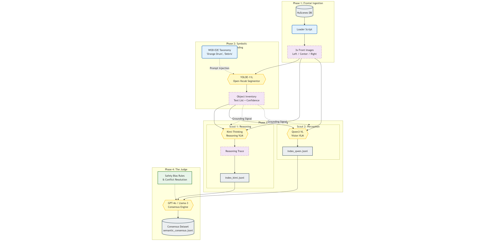
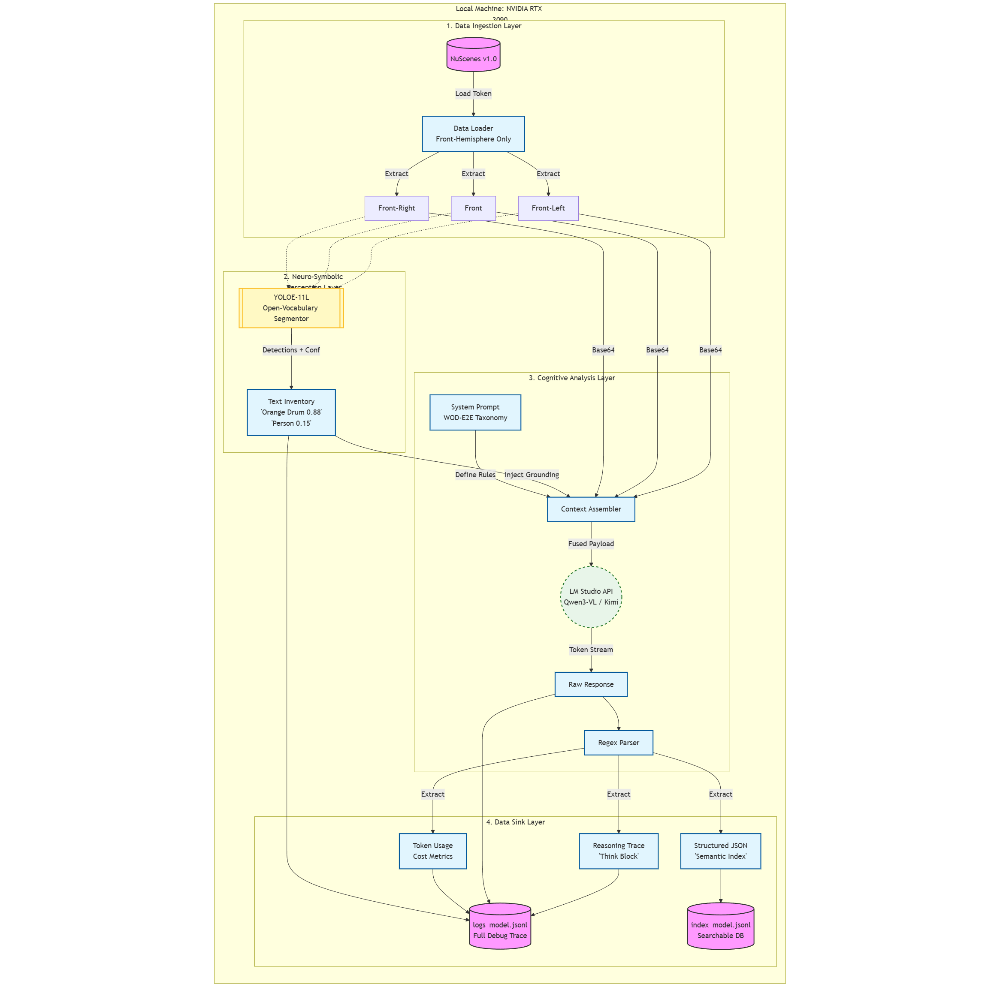
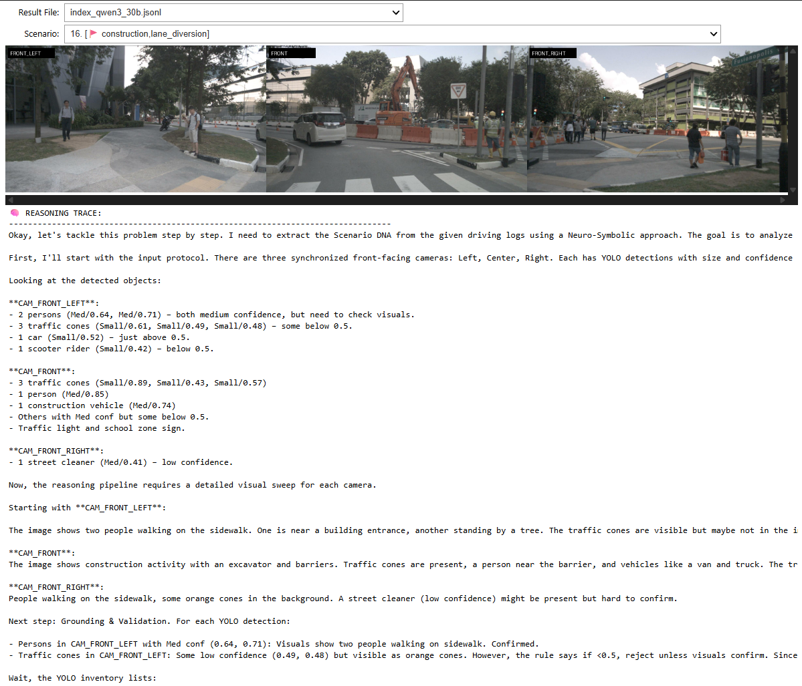

# Semantic-Drive
**Democratizing Long-Tail Data Curation via Open-Vocabulary Grounding and Neuro-Symbolic VLM Consensus**

  

## Abstract
**Semantic-Drive** is a privacy-preserving framework designed to mine safety-critical edge cases from raw autonomous vehicle video logs. Addressing the "Dark Data" crisis in autonomous driving, this project provides a local-first alternative to cloud-based auto-labelers. It runs entirely on consumer-grade hardware (NVIDIA RTX 3090) without transmitting data to external APIs.

It utilizes a **Neuro-Symbolic Architecture**:
1.  **Grounding:** Real-time Open-Vocabulary Segmentation (**YOLOE-11L**) identifies hazards based on the **WOD-E2E Taxonomy**.
2.  **Reasoning:** A Vision-Language Model (**Qwen3-VL / Kimi-Thinking**) performs forensic scene analysis using Chain-of-Thought (CoT).
3.  **Consensus:** A Multi-Model "Judge" synthesizes reports to eliminate hallucinations.

## System Architecture

### 1. Neuro-Symbolic Consensus Architecture
The core innovation of Semantic-Drive is the separation of "Symbolic Grounding" (Perception) from "Cognitive Analysis" (Reasoning), followed by a multi-model consensus stage.


*Figure 1: The High-Level Consensus Architecture. Multiple VLM "Scouts" (e.g., Kimi, Qwen) process grounded visual data. Their reports are synthesized by a "Judge" to produce a high-fidelity semantic index.*

### 2. The Inference Pipeline
For each frame, the system executes a rigorous grounding and reasoning loop to mitigate hallucinations common in pure VLM approaches.


*Figure 2: The Single-Frame Inference Pipeline. An Open-Vocabulary Segmentor (YOLOE-11) injects a textual object inventory into the VLM's context window. The VLM performs a "Visual Sweep" and "Forensic Analysis" before outputting structured JSON.*

## Methodology
The framework operates in three distinct phases:

1.  **Symbolic Grounding (The Eye):** We utilize **YOLOE-11L** (Real-Time Open-Vocabulary Segmentation) to detect specific WOD-E2E taxonomy classes (e.g., "construction barrel", "debris") with a low confidence threshold to maximize recall.
2.  **Cognitive Analysis (The Brain):** A Reasoning VLM (e.g., **Qwen3-VL** or **Kimi-Thinking**) receives the images and the object inventory. It executes a Chain-of-Thought (CoT) process to verify detections, assess environmental conditions (ODD), and determine the impact on the ego-vehicle's path planning.
3.  **Consensus (The Judge):** A separate LLM aggregates reports from multiple scouts to resolve conflicts and finalize the semantic tags.

## Pipeline Overview

The pipeline transforms "Dark Data" (unsearchable video) into a structured Semantic Database:
*   **Input:** Raw NuScenes Camera Feeds (Front-Hemisphere).
*   **Process:** YOLO Inventory Injection -> VLM Skepticism Policy -> Schema Enforcement.
*   **Output:** Rich JSON metadata describing topology, causality, and risk.

## Getting Started

### 1. Prerequisites
*   **Hardware:** NVIDIA GPU (24GB VRAM recommended for Qwen3-30B).
*   **Software:** [LM Studio](https://lmstudio.ai/) running locally on port `1234`.
*   **Data:** [NuScenes v1.0-mini](https://www.nuscenes.org/download) dataset.

### 2. Installation
```bash
# Clone repository
git clone https://github.com/AntonioAlgaida/Semantic-Drive.git
cd Semantic-Drive

# Install dependencies
pip install -r requirements.txt
```

### 3. Configuration
Edit `src/config.py` to point to your dataset:
```python
NUSCENES_DATAROOT = "/path/to/your/nuscenes"
```

## Usage

### Phase 1: Interactive Grounding (Unit Test)
Verify that YOLOE-11 is correctly detecting "Long-Tail" objects (e.g., debris, construction drums) using the interactive notebook:
```bash
jupyter notebook notebooks/03_yoloe_interactive.ipynb
```

### Phase 2: Data Mining (The Scouts)
Launch the mining agents. Ensure the target model is loaded in LM Studio.
```bash
# Run Scout 1 (e.g., Kimi-Thinking)
python -m src.main --model "kimi-vl-thinking" --output_name "kimi_run" --verbose

# Run Scout 2 (e.g., Qwen3-VL)
python -m src.main --model "qwen3-vl-instruct" --output_name "qwen_run" --verbose
```

### Phase 3: Consensus (The Judge)
Merge the outputs from multiple scouts to create the final dataset.
```bash
python -m src.judge --files output/index_kimi_run.jsonl output/index_qwen_run.jsonl
``` 

### Phase 4: Analysis & Visualization
Use the dashboard to inspect the generated "Scenario DNA," reasoning traces, and visual evidence.


*Figure 3: The Semantic-Drive Analysis Dashboard. Left: Panoramic Front-View. Right: Extracted Semantic Metadata and Reasoning Trace.*

```bash
jupyter notebook notebooks/04_results_viewer.ipynb
```

## Semantic Taxonomy (WOD-E2E)
The system is engineered to detect specific long-tail categories defined in the Waymo Open Dataset for End-to-End Driving:
*   **Construction:** Lane diversions, orange drums, workers.
*   **VRU Interaction:** Jaywalking, hesitation at crosswalks.
*   **Foreign Object Debris (FOD):** Trash, rocks, lost cargo.
*   **Adverse Weather:** Hydroplaning risks, glare, sensor occlusion.
*   **Special Vehicles:** Emergency vehicles, school buses.

## License
This project is licensed under the MIT License - see the LICENSE file for details.

## Citation
If you use this work in your research, please cite:

```bibtex
@misc{semantic_drive_2025,
  author = {Guillen-Perez, Antonio},
  title = {Semantic-Drive: Democratizing Long-Tail Data Curation via Open-Vocabulary Grounding and Neuro-Symbolic VLM Consensus},
  year = {2025},
  publisher = {GitHub},
  journal = {GitHub repository},
  howpublished = {\url{https://github.com/AntonioAlgaida/Semantic-Drive}}
}
```