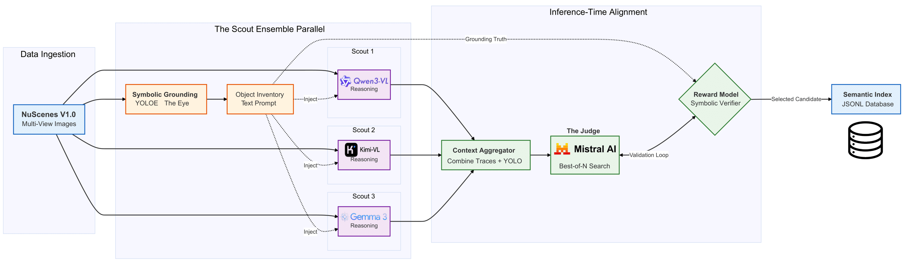
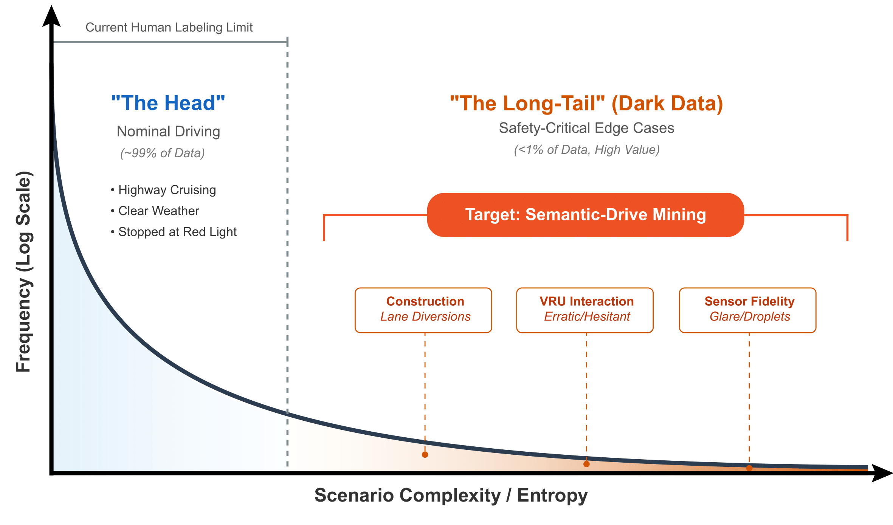
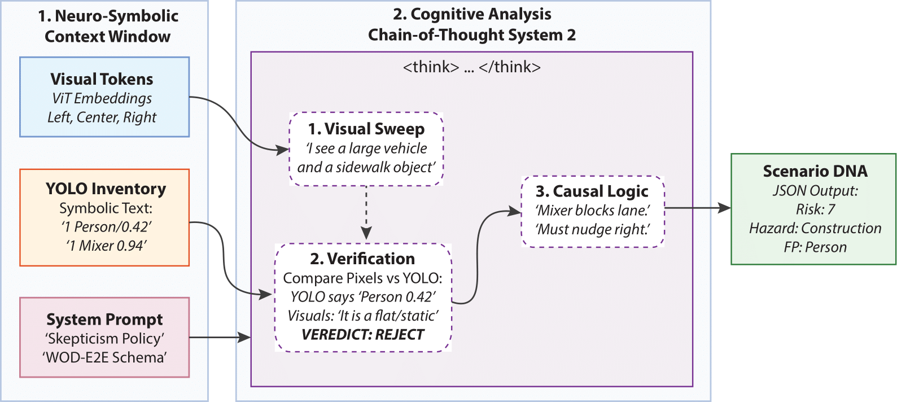
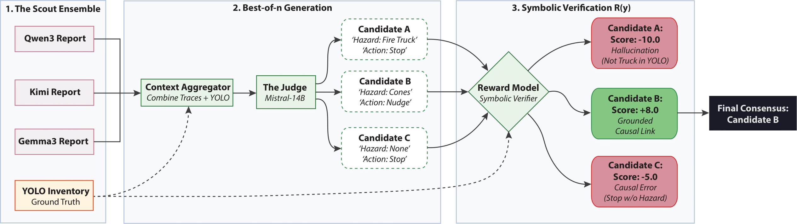

# Semantic-Drive
**Democratizing Long-Tail Data Curation via Open-Vocabulary Grounding and Neuro-Symbolic VLM Consensus**

<p align="center">
  This repository contains the official implementation for <strong>"Semantic-Drive"</strong>, a local-first framework designed to mine safety-critical edge cases from raw autonomous vehicle video logs using "System 2" Neuro-Symbolic reasoning.
</p>

<p align="center">
  <a href="https://arxiv.org/abs/TODO_INSERT_ARXIV_ID" target="_blank">
    
  </a>
  <a href="https://huggingface.co/spaces/AntonioAlgaida/Semantic-Drive-Explorer" target="_blank">
    
  </a>
  <a href="https://huggingface.co/datasets/agnprz/semantic-drive-results" target="_blank">
    
  </a>
  <a href="LICENSE">
    
  </a>
  
  
</p>

<p align="center">
  A project by <strong>Antonio Guillen-Perez</strong> | 
  <a href="https://antonioalgaida.github.io/" target="_blank"><strong>Portfolio</strong></a> | 
  <a href="https://www.linkedin.com/in/antonioguillenperez/" target="_blank"><strong>LinkedIn</strong></a> | 
  <a href="https://scholar.google.com/citations?user=BFS6jXwAAAAJ" target="_blank"><strong>Google Scholar</strong></a>
</p>

<p align="center">
  
  <br>
  <em>Figure 1: Semantic-Drive Framework Overview. The system combines real-time object detection (YOLOE-11) with Neuro-Symbolic reasoning VLMs (Qwen3-VL, Kimi-VL) to mine safety-critical edge cases from raw autonomous vehicle video logs without cloud costs.</em>
</p>  

<p align="center">
  
  <br>
  <em>Figure 2: The "Dark Data" Crisis. While 99% of logs represent nominal driving, the critical 1% lies in the "Long Tail" (e.g., erratic VRUs, sensor degradation). Semantic-Drive automates the mining of this region without cloud costs.</em>
</p>

## Abstract
**Semantic-Drive** is a privacy-preserving framework designed to mine safety-critical edge cases from raw autonomous vehicle video logs. Addressing the "Dark Data" crisis in autonomous driving, this project provides a local-first alternative to cloud-based auto-labelers. It runs entirely on consumer-grade hardware (NVIDIA RTX 3090) without transmitting data to external APIs.

The system employs a **Neuro-Symbolic Architecture** that fuses real-time object detection with the causal reasoning capabilities of Vision-Language Models (VLMs). By enforcing a strict "Scenario DNA" schema derived from the **Waymo Open Dataset for End-to-End Driving (WOD-E2E)**, Semantic-Drive transforms unstructured video into a queryable semantic database, enabling engineers to retrieve complex scenarios such as construction diversions, erratic pedestrian behavior, and sensor degradation events.

**Key Achievements:**
*   **High Recall:** Achieved **0.966 Recall** on safety-critical edge cases (vs. 0.475 for CLIP embeddings).
*   **System-2 Reasoning:** Reduced Risk Assessment Error (MAE) by **51%** via Neuro-Symbolic verification.
*   **Privacy-First:** Runs entirely on a single **NVIDIA RTX 3090** (24GB VRAM).
*   **Cost Efficiency:** Reduces curation costs by **~97%** compared to GPT-4V/Gemini APIs.

- [Semantic-Drive](#semantic-drive)
  - [Abstract](#abstract)
  - [Folder Structure](#folder-structure)
  - [Methodology: The Neuro-Symbolic Pipeline](#methodology-the-neuro-symbolic-pipeline)
    - [Stage 1: Symbolic Grounding (The Eye)](#stage-1-symbolic-grounding-the-eye)
    - [Stage 2: Cognitive Analysis (The Brain)](#stage-2-cognitive-analysis-the-brain)
    - [Stage 3: Inference-Time Consensus (The Judge)](#stage-3-inference-time-consensus-the-judge)
  - [Methodology](#methodology)
  - [Key Quantitative Results](#key-quantitative-results)
  - [Interactive Demo \& Dataset](#interactive-demo--dataset)
  - [Setup and Reproducibility](#setup-and-reproducibility)
    - [1. Prerequisites](#1-prerequisites)
    - [2. Installation](#2-installation)
    - [3. Configuration](#3-configuration)
  - [Local Setup (RTX 3090 / 4090 / Similar)](#local-setup-rtx-3090--4090--similar)
    - [1. Build the Inference Engine](#1-build-the-inference-engine)
    - [2. Download Optimized Models (Q4\_K\_M)](#2-download-optimized-models-q4_k_m)
    - [3. Prepare NuScenes Data](#3-prepare-nuscenes-data)
    - [4. Run Inference Server (Docker)](#4-run-inference-server-docker)
    - [5. Run the Scouts (Mining)](#5-run-the-scouts-mining)
    - [6. Run the Judge (Consensus)](#6-run-the-judge-consensus)
    - [7. Human Verification (Optional)](#7-human-verification-optional)
  - [Enterprise / Server Setup](#enterprise--server-setup)
    - [1. Build Inference Engine (Docker)](#1-build-inference-engine-docker)
    - [2. Download Dataset](#2-download-dataset)
    - [3. Run Scouts (Mining Agents)](#3-run-scouts-mining-agents)
      - [**Option A: Qwen3-VL-30B (Thinking)**](#option-a-qwen3-vl-30b-thinking)
      - [**Option B: Kimi-VL-Thinking**](#option-b-kimi-vl-thinking)
      - [**Option C: Gemma-3-27B**](#option-c-gemma-3-27b)
    - [4. Run Consensus (The Judge)](#4-run-consensus-the-judge)
  - [Semantic Taxonomy (WOD-E2E)](#semantic-taxonomy-wod-e2e)
  - [Citation](#citation)
  - [License](#license)

## Folder Structure

```text
Semantic-Drive/
├── assets/                     # Architecture diagrams and paper figures
├── llama.cpp/                  # Setup location for llama.cpp inference engine
├── models/                     # GGUF Quantized Models & Vision Projectors
├── notebooks/                  # Interactive experiments (Grounding checks, Dashboard)
├── nuscenes_data/              # Local dataset storage (blobs + metadata)
├── output/                     # Generated semantic indexes (.jsonl) and execution logs
├── src/                        # Core Neuro-Symbolic Framework
│   ├── data/                   
│   │   ├── loader.py           # NuScenes API wrapper (Sparse/Dense sampling)
│   │   └── visuals.py          # Multi-view image stitching utilities
│   ├── model/                  
│   │   ├── detector.py         # YOLOE-11 Open-Vocabulary Segmentor wrapper
│   │   ├── prompts.py          # System Prompts & WOD-E2E Schema definition
│   │   └── vlm_client.py       # Robust API client (OpenAI/Gemini compatible)
│   ├── analytics.py            # Cost/Latency/Token usage analysis
│   ├── benchmark.py            # Precision/Recall ablation scripts
│   ├── config.py               # Global configuration (Paths, Camera selection)
│   ├── main.py                 # Neuro-Symbolic Pipeline Orchestrator (The Scout)
│   ├── judge.py                # Multi-Model Consensus Engine (The Judge)
│   └── reward.py               # Inference-Time Symbolic Verification logic
├── download_nuscenes.sh        # Automated downloader for NuScenes TrainVal
├── requirements.txt            # Python dependencies
└── README.md                   # Project documentation
```

## Methodology: The Neuro-Symbolic Pipeline

The system employs a "Judge-Scout" architecture that separates perception into three distinct stages to mitigate the hallucinations common in pure Vision-Language Models.

<p align="center">
  
</p>

### Stage 1: Symbolic Grounding (The Eye)
We utilize **YOLOE-11** (Real-Time Open-Vocabulary Segmentation) to perform an initial visual sweep. It detects objects from the **WOD-E2E Taxonomy** (e.g., "construction barrel", "debris") with a high-recall threshold (0.15). This "Object Inventory" is converted to text and injected into the VLM's context window.

<p align="center">
  
  <br>
  <em>Figure 3: Stage 1 - Symbolic Grounding with YOLOE-11. The object inventory is extracted and formatted for VLM consumption.</em>
</p>

### Stage 2: Cognitive Analysis (The Brain)
An ensemble of **Reasoning VLMs** (Qwen3-VL, Kimi-VL, Gemma-3) processes the images and the symbolic inventory. They execute a **Chain-of-Thought (CoT)** process to verify detections ("Skepticism Policy"), assess environmental conditions, and determine causal risks (e.g., "Is the pedestrian interacting with the scene?").

<p align="center">
  
  <br>
  <em>Figure 4: Stage 2 - Cognitive Analysis with Reasoning VLMs. The VLMs verify detections and assess scenario risks using Chain-of-Thought reasoning.</em>
</p>

### Stage 3: Inference-Time Consensus (The Judge)
A separate **Local LLM (Mistral-14B)** aggregates the reports from multiple scouts. It performs an **Inference-Time Search (Best-of-N)**, generating candidate scenarios and scoring them using a deterministic **Symbolic Reward Model** ($R(y)$). This filters out hallucinations that are not grounded in the YOLO inventory.

<p align="center">
  
  <br>
  <em>Figure 5: Stage 3 - Inference-Time Consensus with the Judge. The LLM aggregates multiple scout reports and selects the most consistent scenario.</em>
</p>

## Methodology
The framework operates in four distinct phases:

1.  **Symbolic Grounding (The Eye):** We utilize **YOLOE-11L** (Real-Time Open-Vocabulary Segmentation) to detect specific WOD-E2E taxonomy classes (e.g., "construction barrel", "debris") with a low confidence threshold (0.15) to maximize recall.
2.  **Cognitive Analysis (The Brain):** A Reasoning VLM (e.g., **Qwen3-VL** or **Kimi-Thinking**) receives the images and the object inventory. It executes a Chain-of-Thought (CoT) process to verify detections ("Skepticism Policy"), assess environmental conditions (ODD), and determine the impact on the ego-vehicle's path planning.
3.  **Inference-Time Alignment (Optimization):** To ensure logical consistency, the system generates $N$ candidate scenarios and selects the best one using a symbolic reward function that penalizes hallucinations not supported by the YOLO inventory.
4.  **Consensus (The Judge):** A separate LLM aggregates reports from multiple scouts to resolve conflicts and finalize the semantic tags.

## Key Quantitative Results

We benchmarked the system against a manually verified "Gold Set" of 108 challenging frames.

| Method | Precision | Recall ($\uparrow$) | F1-Score | Risk Error (MAE) $\downarrow$ |
| :--- | :---: | :---: | :---: | :---: |
| **Baseline: CLIP (ViT-L/14)** | 0.683 | 0.475 | 0.560 | N/A |
| **Ablation: Pure VLM (No YOLO)** | 0.691 | 0.814 | 0.747 | 1.389 |
| **Single Scout: Qwen3-VL + YOLO** | 0.714 | 0.932 | 0.809 | 1.130 |
| **Semantic-Drive (Consensus)** | **0.712** | **0.966** | **0.820** | **0.676** |


## Interactive Demo & Dataset

To facilitate reproducibility, we have released the data and an interactive explorer:

*   **Live Demo (Hugging Face Space):** [Semantic-Drive Explorer](https://huggingface.co/spaces/AntonioAlgaida/Semantic-Drive-Explorer)
*   **Dataset (Hugging Face):** [Semantic-Drive Results (N=2,550)](https://huggingface.co/datasets/agnprz/semantic-drive-results)

## Setup and Reproducibility

### 1. Prerequisites
*   **OS:** Linux (Ubuntu 22.04+ Recommended) or Windows WSL2.
*   **Hardware:** NVIDIA GPU with 24GB VRAM (RTX 3090/Similar) for local inference.
*   **Software:** 
    *   [Docker](https://docs.docker.com/engine/install/) & [NVIDIA Container Toolkit](https://docs.nvidia.com/datacenter/cloud-native/container-toolkit/install-guide.html).
    *   Python 3.10+.
*   **Data:** [NuScenes v1.0-trainval](https://www.nuscenes.org/download) (approx 30GB).

### 2. Installation
```bash
# Clone repository
git clone https://github.com/AntonioAlgaida/Semantic-Drive.git
cd Semantic-Drive

# Install dependencies
pip install -r requirements.txt
```

### 3. Configuration
Edit `src/config.py` to point to your local NuScenes dataset path:
```python
NUSCENES_DATAROOT = "/path/to/your/nuscenes"
```

## Local Setup (RTX 3090 / 4090 / Similar)
For consumer hardware with **24GB VRAM**, we use **4-bit Quantized (Q4_K_M)** models. This retains reasoning performance while fitting the model (~19GB) and image context within memory limits.

### 1. Build the Inference Engine
We use `llama.cpp` server for high-throughput local inference.
```bash
git clone https://github.com/ggml-org/llama.cpp
cd llama.cpp
docker build -t local/llama.cpp:server-cuda --target server -f .devops/cuda.Dockerfile .
cd ..
```

### 2. Download Optimized Models (Q4_K_M)
Create a models directory: `mkdir -p models`

**Option A: Qwen3-VL-30B (Thinking)**
```bash
# Main Model (4-bit, ~19GB)
wget -O models/Qwen3-VL-30B-A3B-Thinking-Q4_K_M.gguf "https://huggingface.co/unsloth/Qwen3-VL-30B-A3B-Thinking-GGUF/resolve/main/Qwen3-VL-30B-A3B-Thinking-Q4_K_M.gguf?download=true"
# Vision Projector
wget -O models/mmproj-F16.gguf "https://huggingface.co/unsloth/Qwen3-VL-30B-A3B-Thinking-GGUF/resolve/main/mmproj-F16.gguf?download=true"
```

**Option B: Kimi-VL-Thinking**
```bash
wget -O models/Kimi-VL-A3B-Thinking-2506-Q4_K_M.gguf "https://huggingface.co/ggml-org/Kimi-VL-A3B-Thinking-2506-GGUF/resolve/main/Kimi-VL-A3B-Thinking-2506-Q4_K_M.gguf?download=true"
wget -O models/mmproj-Kimi-VL-A3B-Thinking-2506-f16.gguf "https://huggingface.co/ggml-org/Kimi-VL-A3B-Thinking-2506-GGUF/resolve/main/mmproj-Kimi-VL-A3B-Thinking-2506-f16.gguf?download=true"
```

**The Judge (Mistral-Small-24B-Instruct)**
```bash
wget -O models/Mistral-Small-24B-Instruct-Q4_K_M.gguf "https://huggingface.co/maziyarpanahi/Mistral-Small-24B-Instruct-2501-GGUF/resolve/main/Mistral-Small-24B-Instruct-2501.Q4_K_M.gguf?download=true"
```

### 3. Prepare NuScenes Data
1.  Download `v1.0-mini` or `v1.0-trainval` from [NuScenes.org](https://www.nuscenes.org/).
2.  Extract it to `./nuscenes_data`.
3.  Update `src/config.py` if your path differs.

### 4. Run Inference Server (Docker)
Run this in a separate terminal. Note the reduced context size (`8192`) to save VRAM for the 3090.

```bash
# Example for Qwen3 (Adjust filenames for Kimi)
docker run --rm -it --gpus all \
    -v $(pwd)/models:/models \
    -p 1234:1234 \
    local/llama.cpp:server-cuda \
    -m /models/Qwen3-VL-30B-A3B-Thinking-Q4_K_M.gguf \
    --mmproj /models/mmproj-F16.gguf \
    --port 1234 --host 0.0.0.0 \
    --ctx-size 8192 \
    --n-gpu-layers 999
```

### 5. Run the Scouts (Mining)
```bash
# The script will detect the local server on port 1234
python -m src.main \
    --model "qwen3-30b-local" \
    --output_name "qwen3_local_run" \
    --verbose
```

### 6. Run the Judge (Consensus)
1.  **Stop previous server:** `docker stop $(docker ps -q)`
2.  **Start Judge Server (Text-Only):**
    ```bash
    docker run --rm -d --gpus all -v $(pwd)/models:/models -p 1234:1234 \
        local/llama.cpp:server-cuda \
        -m /models/Mistral-Small-24B-Instruct-Q4_K_M.gguf \
        --port 1234 --host 0.0.0.0 --ctx-size 32768 --n-gpu-layers 999
    ```
3.  **Run Consensus:**
    ```bash
    python -m src.judge \
        --files output/logs_qwen_run.jsonl \
        --output output/consensus_final.jsonl \
        --n 3
    ```

### 7. Human Verification (Optional)
Launch the local Streamlit app to manually verify the results and build your own Gold Set.
```bash
streamlit run src/tools/gold_curator_app.py
```
*Access the dashboard at `http://localhost:8501`.*

---

## Enterprise / Server Setup
For large-scale mining, we recommend using Docker with `llama.cpp` server to bypass GUI overhead.

### 1. Build Inference Engine (Docker)
```bash
git clone https://github.com/ggml-org/llama.cpp
cd llama.cpp
# Build server with CUDA support
docker build -t local/llama.cpp:server-cuda --target server -f .devops/cuda.Dockerfile .
cd ..
```

### 2. Download Dataset
Use the provided script to download and extract the NuScenes blobs (trainval).
```bash
chmod +x download_nuscenes.sh
# Download blobs 1 through 10 (Full Dataset)
./download_nuscenes.sh ./nuscenes_data 1 10
```

### 3. Run Scouts (Mining Agents)
We use **Q8_0** (High Precision) models for maximum reasoning fidelity. Ensure you create a `models/` directory first.

#### **Option A: Qwen3-VL-30B (Thinking)**
```bash
# 1. Download Model & Projector
wget -O models/Qwen3-VL-30B-A3B-Thinking-Q8_0.gguf "https://huggingface.co/unsloth/Qwen3-VL-30B-A3B-Thinking-GGUF/resolve/main/Qwen3-VL-30B-A3B-Thinking-Q8_0.gguf?download=true"
wget -O models/mmproj-F16.gguf "https://huggingface.co/unsloth/Qwen3-VL-30B-A3B-Thinking-GGUF/resolve/main/mmproj-F16.gguf?download=true"

# 2. Start Server (Background)
# Note: Adjust --gpus device=1 based on available hardware
docker run --rm -it --gpus '"device=1"' \
    -v $(pwd)/models:/models -p 1234:1234 \
    local/llama.cpp:server-cuda \
    -m /models/Qwen3-VL-30B-A3B-Thinking-Q8_0.gguf \
    --mmproj /models/mmproj-F16.gguf \
    --port 1234 --host 0.0.0.0 \
    --ctx-size 32768 --n-gpu-layers 999 --batch-size 2048

# 3. Run Miner
CUDA_VISIBLE_DEVICES=1 python -m src.main \
    --model "qwen3-30b-docker" --output_name "qwen3_run" \
    --verbose --port 1234
```

#### **Option B: Kimi-VL-Thinking**
```bash
# 1. Download
wget -O models/Kimi-VL-A3B-Thinking-2506-Q8_0.gguf "https://huggingface.co/ggml-org/Kimi-VL-A3B-Thinking-2506-GGUF/resolve/main/Kimi-VL-A3B-Thinking-2506-Q8_0.gguf?download=true"
wget -O models/mmproj-Kimi-VL-A3B-Thinking-2506-f16.gguf "https://huggingface.co/ggml-org/Kimi-VL-A3B-Thinking-2506-GGUF/resolve/main/mmproj-Kimi-VL-A3B-Thinking-2506-f16.gguf?download=true"

# 2. Start Server
docker run --rm -it --gpus '"device=1"' \
    -v $(pwd)/models:/models -p 1234:1234 \
    local/llama.cpp:server-cuda \
    -m /models/Kimi-VL-A3B-Thinking-2506-Q8_0.gguf \
    --mmproj /models/mmproj-Kimi-VL-A3B-Thinking-2506-f16.gguf \
    --port 1234 --host 0.0.0.0 \
    --ctx-size 32768 --n-gpu-layers 999 --batch-size 2048

# 3. Run Miner
CUDA_VISIBLE_DEVICES=1 python -m src.main \
    --model "kimi-thinking-q8" --output_name "kimi_run" \
    --verbose --port 1234
```

#### **Option C: Gemma-3-27B**
```bash
# 1. Download
wget -O models/gemma-3-27b-it-Q8_0.gguf "https://huggingface.co/unsloth/gemma-3-27b-it-GGUF/resolve/main/gemma-3-27b-it-Q8_0.gguf?download=true"
wget -O models/mmproj-gemma-3-27b-f16.gguf "https://huggingface.co/unsloth/gemma-3-27b-it-GGUF/resolve/main/mmproj-F16.gguf?download=true"

# 2. Start Server
docker run --rm -it --gpus '"device=1"' \
    -v $(pwd)/models:/models -p 1234:1234 \
    local/llama.cpp:server-cuda \
    -m /models/gemma-3-27b-it-Q8_0.gguf \
    --mmproj /models/mmproj-gemma-3-27b-f16.gguf \
    --port 1234 --host 0.0.0.0 \
    --ctx-size 32768 --n-gpu-layers 999 --batch-size 2048

# 3. Run Miner
CUDA_VISIBLE_DEVICES=1 python -m src.main \
    --model "gemma-3-27b-q8" --output_name "gemma_run" \
    --verbose --port 1234
```

### 4. Run Consensus (The Judge)
Once all scouts have finished, merge the results using the Multi-Model Judge (supporting both Local LLMs and Gemini Pro).
```bash
python -m src.judge --files output/index_kimi_run.jsonl output/index_qwen3_run.jsonl --n 3
```

---

## Semantic Taxonomy (WOD-E2E)
The system is engineered to detect specific long-tail categories defined in the Waymo Open Dataset for End-to-End Driving:
*   **Construction:** Lane diversions, orange drums, workers.
*   **VRU Interaction:** Jaywalking, hesitation at crosswalks.
*   **Foreign Object Debris (FOD):** Trash, rocks, lost cargo.
*   **Adverse Weather:** Hydroplaning risks, glare, sensor occlusion.
*   **Special Vehicles:** Emergency vehicles, school buses.

## Citation
If you use **Semantic-Drive** in your research, please cite our work:

```bibtex
@misc{guillen2025semanticdrive,
  author = {Guillen-Perez, Antonio},
  title = {Semantic-Drive: Democratizing Long-Tail Data Curation via Open-Vocabulary Grounding and Neuro-Symbolic VLM Consensus},
  year = {2025},
  publisher = {GitHub},
  journal = {GitHub repository},
  howpublished = {\url{https://github.com/AntonioAlgaida/Semantic-Drive}}
}
```

## License
This project is licensed under the MIT License - see the [LICENSE](LICENSE) file for details.